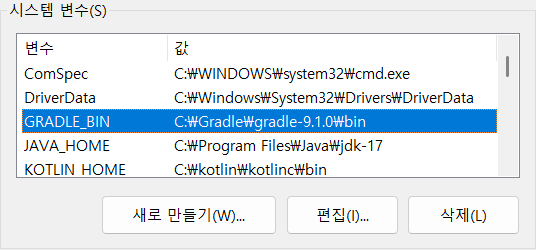
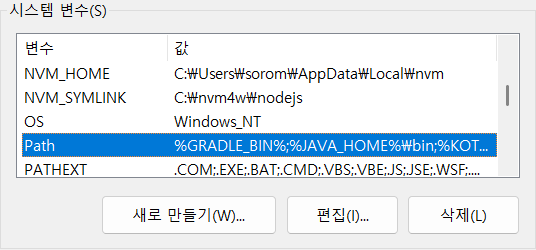

# Kotlin Exercising on Windows os using vsCode

> VS Code에서 Kotlin을 “완전 기초부터” 실습할 수 있도록, 
> 설치부터 첫 실행·디버깅·기본 문법 연습까지 단계별로 안내

---

### 전체 로드맵 (개요)
1. JDK 17 LTS 설치 & 환경변수 설정
    Kotlin은 JDK 8 이상이 필요합니다. 
    기존 JDK 1.7은 유지하되, JDK 17을 추가 설치하고 JAVA_HOME을 전환합니다.

2. Kotlin 컴파일러(kotlinc) 설치
    Windows용 zip을 받아 C:\Kotlin\kotlinc 같은 경로에 두고 PATH에 추가합니다.

3. VS Code 확장 설치
    “Kotlin (fwcd)”, “Code Runner(선택)”, “Gradle for Java(선택)”

4. 첫 실습: Hello World
    단일 파일 컴파일/실행(두 방식)
        a) kotlinc로 컴파일 → java -jar로 실행
        b) 클래스패스 실행: kotlin -classpath out HelloKt

5. 기본 문법 미션
    val/var, 함수/when/반복, null-safety, data class, 컬렉션, 확장함수 순으로 짧은 과제 진행

---

### ✅ 1단계) JDK 17 LTS 설치 및 환경 변수 설정
    - 시작 메뉴 → “환경 변수 편집” 검색 → “환경 변수(N)…”
    - 시스템 변수에서 JAVA_HOME 만들고
    - 값: C:\Program Files\Java\jdk-17 (실제 설치 경로)
    - 시스템 변수의 Path 편집:
    - %JAVA_HOME%\bin 

```bash
# 새 터미널(명령 프롬프트) 열어 확인:
$ java -version → 17.x가 보여야 합니다.
$ javac -version → 17.x 확인.
```

### ✅ 2단계) Kotlin 컴파일러(kotlinc) 설치
> 목적: Kotlin 소스를 직접 컴파일하고 실행할 수 있도록 로컬 컴파일러 설치

```
2-1. 다운로드
    - 웹 브라우저에서 아래 주소로 이동:
    👉 https://github.com/JetBrains/kotlin/releases

    - 최신 Stable Release 중 kotlin-compiler-1.xx.xx.zip 파일을 
      다운로드합니다.
      (예: kotlin-compiler-2.0.21.zip)

2-2. 압축 해제
    예시 경로:
    C:\Kotlin\kotlinc

2-3. 환경변수 등록
    - 시작 → 환경 변수 편집 → 환경 변수(N)…
    - 시스템 변수 → Path → 편집
    새 항목 추가:
    C:\Kotlin\kotlinc\bin

    확인 후 새 cmd 창을 열어 아래 실행:
    $ kotlinc -version
    → info: kotlinc-jvm 2.0.x (JRE 17.x.x) 처럼 나오면 성공 🎉

2-4. Kotlin 파일 테스트
    - VS Code 또는 메모장에서 hello.kt 파일 생성:

    ```
    // 파일명: hello.kt
    fun main() {
        println("Hello, Kotlin!")
    }
    ```

    - 컴파일: (명령 프롬프트에서)
    ```
    $ kotlinc hello.kt -include-runtime -d hello.jar
    ```

    - 실행:
    ```
    $ java -jar hello.jar
    
    ```

```

> vsCode extension 설치
> 확장 이름	설명	설치 여부

```

| 확장 이름                          | 설명                                              | 설치 여부 |
| ---------------------------------- | ------------------------------------------------- | --------- |
| **Kotlin (by fwcd)**               | JetBrains 공식 지원 Kotlin Language Server (필수) | ✅ 필수    |
| **Code Runner (by Jun Han)**       | VSCode 내에서 코드 한 줄로 실행 (`Ctrl+Alt+N`)    | ⭐ 추천    |
| **Gradle for Java (by Microsoft)** | Gradle 기반 Kotlin 프로젝트 관리 시 편리          | ⚙️ 선택    |

```


```bash
# Project Structure
C:\Users\sorom\dev\kotlinEx
│
├─ 📁 src
│   ├─ 📁 main
│   │   └─ 📁 kotlin
│   │       ├─ Main.kt
│   │       └─ sample/
│   │           └─ Hello.kt
│   │
│   └─ 📁 test
│       └─ 📁 kotlin
│           └─ MainTest.kt
│
├─ 📁 bin
│   └─ (컴파일된 .class 파일 저장)
│
├─ 📁 libs
│   └─ (외부 라이브러리, 나중에 추가)
│
├─ 📄 build.bat      ← 직접 실행용 빌드 스크립트
├─ 📄 run.bat        ← 실행용 스크립트
├─ 📄 run.sh         ← build and run shell script
└─ 📄 README.md

# 폴더구조 만들기 (manually)
cd C:\Users\sorom\dev\kotlinEx

mkdir src
mkdir src\main
mkdir src\main\kotlin
mkdir src\main\kotlin\sample
mkdir src\test
mkdir src\test\kotlin
mkdir bin
mkdir libs

```

> 이제 build.bat → run.bat 순으로 실행하면
✅ Hello KotlinEx Project! 출력이 나오게 됩니다.

---

### Q: Lambda 표현식, Lambda의 의미는 무엇인가?

> **“람다(Lambda)”**는 Kotlin뿐 아니라,<br>
> Python, Java, JavaScript 등 대부분의 현대 언어에서 등장하는 핵심 개념입니다.

🧠 1️⃣ ‘람다(Lambda)’의 어원과 본뜻

```
 Lambda(λ) 는 수학의 람다 계산법(Lambda Calculus) 에서 유래했습니다. 
 1930년대에 앨런 튜링과 알론조 처치(Alonzo Church) 가 고안한 
 “함수를 수학적으로 표현하는 기호 체계”입니다.

 # 수학적 표현
 λx. x + 1

→ “입력값 x를 받아 x + 1을 반환하는 함수”
즉, 이름이 없는 익명 함수를 뜻합니다.
그래서 “람다”는 익명 함수(Anonymous Function) 의 의미로 쓰이게 되었습니다.

```

⚙️ 2️⃣ Kotlin에서의 람다 표현식(Lambda Expression)

```kotlin
Kotlin에서는 함수를 “값처럼” 다룰 수 있습니다.
즉, 함수도 변수에 저장하거나, 함수의 인자로 전달할 수 있습니다.
람다의 기본 형태는 다음과 같습니다 👇

    ```
    # 람다 표현식
    { 매개변수 -> 수행문 }

    val square = { x: Int -> x * x }
    println(square(5)) // 25
    ```
```

🧩 3️⃣ 람다를 쓰는 이유
```
| 기존 방식                                       | 람다 사용 시                            |
| ----------------------------------------------- | --------------------------------------- |
| `fun add(a: Int, b: Int): Int { return a + b }` | `val add = { a: Int, b: Int -> a + b }` |
| 코드가 장황함                                   | 간결함                                  |
| 함수 이름 필수                                  | 이름 없이도 사용 가능                   |
| 일회용 함수 사용 불편                           | 람다는 한 줄로 간단하게 가능            |

```

🧮 4️⃣ 람다의 예 — 컬렉션과 함께
람다는 컬렉션 처리에서 가장 강력하게 쓰입니다

```kotlin
// { it -> ... } 또는 { it * 2 } 구문은 모두 람다입니다.
// it은 매개변수가 하나일 때 자동으로 붙는 이름입니다.

val numbers = listOf(1, 2, 3, 4, 5)

// 각 요소를 2배로
val doubled = numbers.map { it * 2 }

// 짝수만 필터링
val evens = numbers.filter { it % 2 == 0 }

// 합계 구하기
val sum = numbers.reduce { acc, n -> acc + n }

println(doubled) // [2, 4, 6, 8, 10]
println(evens)   // [2, 4]
println(sum)     // 15

```

⚡ 5️⃣ 고차 함수(High-Order Function)와의 관계
> 고차 함수란 “다른 함수를 인자로 받거나 반환하는 함수”입니다.<br>
> 람다는 고차 함수의 재료로 쓰이는 “익명 함수의 문법적 표현”입니다.

```kotlin
fun operate(a: Int, b: Int, op: (Int, Int) -> Int): Int {
    return op(a, b)
}

// 여기서 op가 바로 람다 함수 매개변수입니다.
val sum = operate(3, 5) { x, y -> x + y }
val mul = operate(3, 5) { x, y -> x * y }
```

--- 
💡 람다와 일반 함수의 차이점
> Kotlin에서 람다({})와 일반 함수(fun)은 **“동작의 단위”**라는 점에서는 같지만, <br>
> 정의 방식과 사용 목적이 다릅니다.

```
| 구분         | 일반 함수                     | 람다 표현식                  |
| ------------ | ----------------------------- | ---------------------------- |
| 정의 키워드  | `fun`                         | `{}` (익명 함수)             |
| 이름         | 필수                          | 없음 (익명 함수)             |
| 반환 타입    | 명시 가능                     | 타입 추론됨                  |
| 호출 방식    | `함수명()`                    | 변수에 담거나 인자로 전달    |
| 주 사용 목적 | 재사용 목적, 명확한 기능 단위 | 일회성, 간결한 표현          |
| 예시 코드    | `fun add(a:Int,b:Int)=a+b`    | `val add={a:Int,b:Int->a+b}` |

```

📄 예시: 동일한 기능을 함수와 람다로 구현

```kotlin

// 일반 함수
fun greet(name: String): String {
    return "Hello, $name!"
}

// 람다 표현식
val greetLambda: (String) -> String = { name -> "Hello, $name!" }

fun main() {
    println(greet("Joshua"))
    println(greetLambda("Joshua"))
}

    ```
    Hello, Joshua!
    Hello, Joshua!
    ```
```

> 📍둘 다 결과는 같지만: <br>
> 일반 함수는 “명시적인 이름을 가진 재사용 가능한 기능 단위” <br>
> 람다는 “필요할 때 즉석에서 정의해 전달하는 익명 함수”      <br>
>

>⚙️ 람다의 장점 <br>
> 함수 이름이 필요 없음 → 간결 <br>
> 코드 흐름 중에 직접 정의 가능 → 고차 함수와 잘 어울림 <br>
> 일회용 동작 정의에 최적 <br>

```kotlin
listOf(1, 2, 3).forEach { println(it) }
```

> 💡 2️⃣ 람다 캡처(Closure) — 외부 변수 접근<br>
> 람다는 자신의 외부 스코프에 있는 변수를 “기억(capture)” 할 수 있습니다.<br>
> 이걸 클로저(closure) 라고 부릅니다.<br>
> 즉, 람다는 단순히 코드를 담는 블록이 아니라,<br>
> 그 코드가 작성된 환경(context)까지 기억하는 객체입니다.<br>

📄 예시 1: 외부 변수 읽기
```kotlin
fun main() {
    val greeting = "Hello"
    val say = { name: String -> "$greeting, $name!" } // 외부 변수 'greeting' 접근
    println(say("Joshua"))
}

    ```
    Hello, Joshua!
    ```
```

> 람다는 greeting이 자기 내부에 없지만,<br>
> 정의될 당시의 외부 변수 greeting을 “캡처”하여 사용할 수 있습니다.

📄 예시 2: 외부 변수 수정 (주의점)
```kotlin
fun main() {
    var counter = 0
    val increment = { counter++ }  // 외부 변수 'counter'를 캡처
    repeat(5) { increment() }
    println("counter = $counter")
}

    ```
    counter = 5
    ```
```

> 람다는 자신이 만들어질 당시의 외부 변수를 참조 형태로 저장하기 때문에<br>
> 내부에서 값을 읽거나 수정할 수도 있습니다.<br>
> (이것은 자바의 “익명 클래스”와는 다른 강력한 기능입니다.)<br>

📄 예시 3: 람다가 외부 상태를 기억하는 “함수 생성기”
```kotlin
fun makeCounter(): () -> Int {
    var count = 0
    return {
        count++
        count
    }
}

fun main() {
    val counter1 = makeCounter()
    val counter2 = makeCounter()

    println(counter1()) // 1
    println(counter1()) // 2
    println(counter2()) // 1
}

```
> 각 람다(counter1, counter2)는 자신만의 독립적인 count 변수를 캡처하고 있으므로<br>
> 서로 영향을 주지 않습니다.<br>
> 즉, 함수 호출 당시의 “환경”을 함께 저장하는 클로저입니다.<br>

> 🧩 정리
> ```
>| 구분                     | 설명                                                |
>| ------------------------ | --------------------------------------------------- |
>| **람다(Lambda)**         | 이름 없는 짧은 함수 표현식 (`{}`)                   |
>| **일반 함수(Function)**  | 이름이 있는 명시적 함수 (`fun`)                     |
>| **클로저(Closure)**      | 람다가 생성될 때 외부 변수를 기억하고 사용하는 기능 |
>| **장점**                 | 간결한 코드, 상태 유지, 고차함수 활용에 유용        |
>
> ```

---
⚙️ 1️⃣ 코루틴(Coroutine)이란?
> Coroutine = Co + Routine (협력적 루틴)<br>
> 한 프로그램 안에서 여러 작업이 동시에 진행되는 것처럼 보이도록<br>
> 비동기(Asynchronous) 코드를 순차적으로 표현하는 Kotlin의 구조입니다.<br>
> - 일반 스레드(thread)는 무겁고 비싼 자원이지만,<br>
>   코루틴은 ***경량화된 스레드*** 개념으로 수천 개도 동시에 실행할 수 있습니다.

🧩 2️⃣ 람다와 코루틴의 관계
> Kotlin에서 코루틴의 핵심 문법은 launch, async, runBlocking 등이며<br>
> 이들은 모두 람다를 인자로 받는 고차 함수입니다. <br>
> - 코루틴은 “람다 함수”를 비동기적으로 실행하도록 스케줄링하는 프레임워크입니다.

---
> 📘 예시 1: launch { } — 람다 기반의 비동기 실행
```kotlin
import kotlinx.coroutines.*

fun main() = runBlocking {       // runBlocking: main을 코루틴 범위로 만듦
    launch {                     // launch: 새로운 코루틴을 실행
        delay(1000L)             // 1초 비동기 지연 (스레드 블로킹 없이)
        println("World!")
    }
    println("Hello,")            // 먼저 실행됨
}

    ```
    Hello,
    World!
    ```
```
> 📍 여기서 launch { ... } 안의 { ... } 부분이 바로 람다 표현식입니다.<br>
>     즉, launch라는 고차 함수가 람다를 전달받아 코루틴으로 실행합니다.

📘 예시 2: async { } — 결과를 반환하는 코루틴 (Deferred)
```kotlin
import kotlinx.coroutines.*

fun main() = runBlocking {
    val result = async {
        delay(500L)
        3 + 5   // 람다의 마지막 줄이 반환값
    }
    println("결과: ${result.await()}")
}
    ```
    결과: 8
    ```
```
> async { ... } 역시 람다 블록을 인자로 받는 고차 함수입니다.<br>
> 이 람다의 결과는 Deferred<T> 객체로 감싸져 있고,<br>
> await()로 실제 값을 얻습니다.

💡 3️⃣ suspend 함수란?
> 코루틴 안에서 비동기 중단(suspend) 가능한 함수를 선언할 때<br>
> fun 앞에 suspend 키워드를 붙입니다.<br>

```kotlin
suspend fun fetchData(): String {
    delay(1000L)
    return "데이터 수신 완료!"
}

```
> 이 함수는 일반 함수처럼 보이지만,<br>
> 실제로는 “중단(suspend) 가능한 람다 형태로 변환되어 컴파일”됩니다.
> 즉, 코틀린 컴파일러가 내부적으로 다음처럼 변환합니다 👇<br>
> (간단히 개념만 표현)
```kotlin
(val continuation) -> { ... }  // 즉, 람다 형태의 suspend function
```
> 그래서 suspend 함수는 결국 람다 기반 구조로 실행되는 특별한 함수입니다.

⚙️ 4️⃣ 람다와 코루틴 구조 연결 요약
```
| 개념             | 설명                                | 공통점                        |
| ---------------- | ----------------------------------- | ----------------------------- |
| **람다**         | 익명 함수 표현식 (`{}`)             | 고차 함수에 인자로 전달 가능  |
| **코루틴 빌더**  | `launch`, `async`, `runBlocking` 등 | 람다를 인자로 받음            |
| **suspend 함수** | 중단 가능한 함수                    | 내부적으로 람다 형태로 변환   |
| **결론**         | “람다 기반의 비동기 실행 모델”      | 람다 + 고차함수 = 코루틴 기반 |

```

📘 예시 3: 실무 스타일 — 네트워크 호출 시뮬레이션
```kotlin
import kotlinx.coroutines.*

suspend fun getUser(): String {
    delay(1000L)
    return "Joshua"
}

suspend fun getUserProfile(name: String): String {
    delay(500L)
    return "$name의 프로필 정보"
}

fun main() = runBlocking {
    println("데이터 로드 시작...")

    val userDeferred = async { getUser() }           // async 람다
    val profileDeferred = async { getUserProfile("Joshua") }

    println("사용자: ${userDeferred.await()}")
    println("프로필: ${profileDeferred.await()}")

    println("모든 데이터 로드 완료!")
}

    ```
    데이터 로드 시작...
    사용자: Joshua
    프로필: Joshua의 프로필 정보
    모든 데이터 로드 완료!
    ```
```
> 모든 async { ... } 블록은 람다로 정의된 비동기 코드 조각입니다.<br>
> launch / async / withContext 등은 결국 **람다를 실행하는 <br>
> “코루틴 컨테이너”**라고 볼 수 있습니다.

🧠 5️⃣ 실무 관점 정리
```
| 관점               | 설명                                                                  |
| ------------------ | --------------------------------------------------------------------- |
| **람다**           | “익명 함수”로 동작을 표현                                             |
| **코루틴**         | “람다로 정의된 동작을 비동기적으로 실행하는 프레임워크”               |
| **suspend 함수**   | “람다처럼 작동하는 비동기 함수” (컴파일러가 continuation 객체로 변환) |
| **async / launch** | “람다를 받아 새로운 코루틴을 스케줄링하는 고차 함수”                  |
| **결국**           | 코루틴은 람다 기반의 비동기 실행 시스템이다.                          |

```

🧠 Unresolved reference: kotlinxkotlin(UNRESOLVED_REFERENCE: 원인 정리
> 현재 VS Code + kotlinc(수동 컴파일) 환경에서 실행 중이기 때문에,<br>
> kotlinx.coroutines 라이브러리가 기본 classpath에 포함되어 있지 않습니다.

🧠 원인 정리
> Kotlin 표준 컴파일러(kotlinc)는 기본적으로 표준 라이브러리(kotlin-stdlib) 만 포함합니다. <br>
> 코루틴 라이브러리(kotlinx-coroutines-core)는 별도 JAR 파일을<br>
> 직접 classpath에 추가해야 합니다.

✅ 방법 1: (추천) — JAR 수동 다운로드 + kotlinc classpath 추가
① 코루틴 JAR 파일 다운로드

아래 공식 릴리스 페이지에서 최신 안정 버전을 받으세요 👇
🔗 https://github.com/Kotlin/kotlinx.coroutines/releases

```
✅ 다운로드 링크

MavenCentral 검색 페이지: kotlinx-coroutines-core · Maven Repository 
Maven Repository

최신 안정 버전 사용 권장: 예를 들어 1.10.2 버전이 오늘 시점의 최신 중 하나입니다. 
GitHub

다운로드 직접 링크 예시:
https://repo1.maven.org/maven2/org/jetbrains/kotlinx/kotlinx-coroutines-core/1.10.2/kotlinx-coroutines-core-1.10.2.jar
```

예:
kotlinx-coroutines-core-jvm-1.9.0.jar
를 다운로드합니다.

👉 다운로드 후 예를 들어
```bash
C:\Kotlin\libs\kotlinx-coroutines-core-jvm-1.9.0.jar

```

-- 

✅ vsCode 에서 (libs 폴더에)라이브러리 (jar파일들)추가 후,
> build.bat, run.bat 수정을 해도, <br>
> kotlinc 직접 사용 환경에서 serialization 플러그인까지 수동으로 연결하기 <br>
> Kotlin 직렬화는 단순 jar 라이브러리가 아니라 “컴파일러 플러그인”이 필요해서, <br>
> Gradle 또는 IntelliJ 프로젝트처럼 플러그인이 자동으로 붙는 빌드 시스템을 써야 합니다. <br>

---

✅ 가장 확실한 해결 방법 (Gradle 프로젝트 전환)
> 프로젝트 루트(C:\Users\sorom\dev\kotlinEx)에 아래 세 파일만 추가

> 1. build.gradle.kts    <br>
> 2. settings.gradle.kts <br>
> 3. Gradle 설치 및 실행 <br>

```bash
// build.gradle.kts

import java.time.LocalDateTime
import java.time.format.DateTimeFormatter

plugins {
    kotlin("jvm") version "2.0.21"
    kotlin("plugin.serialization") version "2.0.21"
    application
}

repositories { mavenCentral() }


dependencies {
    // ✅ 코루틴 및 직렬화 라이브러리
    implementation("org.jetbrains.kotlinx:kotlinx-coroutines-core:1.10.2")
    implementation("org.jetbrains.kotlinx:kotlinx-serialization-json:1.7.3")
}

application {
    // ✅ Kotlin main 함수 위치
    mainClass.set("main.kotlin.MainKt")
}

// ----------------------------------------------------------
// ✅ 빌드 정보 자동 삽입: version, author, build time
// ----------------------------------------------------------
val buildTime: String = LocalDateTime.now().format(DateTimeFormatter.ofPattern("yyyy-MM-dd HH:mm:ss"))
val appVersion = "1.0.0"
val appAuthor = "Joshua Park"

// ✅ JAR 생성 시 메인 클래스 속성 추가
tasks.jar {
    manifest {
        //attributes["Main-Class"] = "main.kotlin.MainKt"
        attributes(
            "Main-Class" to "main.kotlin.MainKt",
            "Implementation-Title" to "KotlinEx",
            "Implementation-Version" to appVersion,
            "Built-By" to appAuthor,
            "Build-Time" to buildTime
        )
    }

    // ✅ 모든 런타임 종속 라이브러리를 포함 (Fat Jar)
    duplicatesStrategy = DuplicatesStrategy.EXCLUDE
    from(configurations.runtimeClasspath.get().map { if (it.isDirectory) it else zipTree(it) })

    archiveFileName.set("kotlinEx-standalone.jar")
}

```

```kotlin
// settings.gradle.kts
rootProject.name = "kotlinEx"
```

---
<br>

⚙️ Gradle 설치 및 실행 <br>
✅ 1️⃣ Gradle 수동 설치 (공식 권장 방법)<br>
> 📍 단계 요약 <br>
> Gradle ZIP 다운로드 <br>
> 압축 해제           <br>
> 환경 변수 설정      <br>
> 설치 확인           <br>

```
📦 (1) ZIP 파일 다운로드

공식 사이트에서 최신 안정 버전 받기:
🔗 https://gradle.org/releases

예:
👉 gradle-8.10.2-bin.zip 다운로드
(현재 최신 버전 중 하나입니다)

📁 (2) 압축 해제
다운로드한 ZIP을 예를 들어 다음 경로에 풀어줍니다:

C:\Gradle\gradle-9.1.0\
 ├─ bin\
 ├─ lib\
 └─ LICENSE
```




```bash
$ gradle -v

------------------------------------------------------------
Gradle 9.1.0
------------------------------------------------------------

Build time:    2025-09-18 13:05:56 UTC
Revision:      e45a8dbf2470c2e2474ccc25be9f49331406a07e

Kotlin:        2.2.0
Groovy:        4.0.28
Ant:           Apache Ant(TM) version 1.10.15 compiled on August 25 2024
Launcher JVM:  17.0.17 (Oracle Corporation 17.0.17+8-LTS-360)
Daemon JVM:    C:\Program Files\Java\jdk-17 (no JDK specified, using current Java home)
OS:            Windows 11 10.0 amd64

$ javac -version
javac 17.0.17

$ java -version
java version "17.0.17" 2025-10-21 LTS
Java(TM) SE Runtime Environment (build 17.0.17+8-LTS-360)
Java HotSpot(TM) 64-Bit Server VM (build 17.0.17+8-LTS-360, mixed mode, sharing)

$ kotlinc -version
info: kotlinc-jvm 2.2.21 (JRE 17.0.17+8-LTS-360)

$ where gradle
C:\Gradle\gradle-9.1.0\bin\gradle
C:\Gradle\gradle-9.1.0\bin\gradle.bat

```

```
cd C:\Users\sorom\dev\kotlinEx
gradle run
```
> - Gradle이 자동으로: <br>
> - Kotlin 컴파일러 다운로드 <br>
> - Serialization 플러그인 적용 <br>
> - @Serializable, Json.encodeToString() 모두 활성화 <br>
> - 코루틴, JSON 직렬화 자동 관리 <br>

✅ 4️⃣ 추가 팁
프로젝트 전체 빌드:
```
# 프로젝트 전체 빌드:
gradle build

# 캐시 삭제 후 재빌드:
gradle clean build

# JAR 실행 파일 생성:
gradle jar

```
--- 
<br>

✅ 최종 추천 조합
> - Windows 11 + JDK17 <br>
> - Gradle 9.1         <br>
> - Kotlin 2.2.0       <br> 

--- 
> Scanner(System.in)을 사용하는 <br>
> 콘솔 입력 프로그램을 Gradle run으로 실행했을 때 <br>
> 표준 입력이 연결되지 않는 환경 문제 

```
    (이런 경우), gradle run 으로 실행 하지 말고,
    Gradle 대신 직접 실행 (가장 간단하고 추천)
    빌드 후 생성된 .jar를 직접 실행하면
    입력/출력 모두 정상 작동합니다.

    gradle clean build
    java -jar ./build/libs/kotlinEx-standalone.jar

    ✅ 5️⃣ 완성된 결과
    - JAR 파일 이름: kotlinEx-standalone.jar
    - 포함 내용:
    - Kotlin runtime
    - Coroutines, Serialization
    - Main class entry
    - Metadata (version, author, build time)
    - 외부 의존성 없음 — java -jar로 어디서나 실행 가능

    ----------------------------
    Kotlin Basic Practice Menu
    ----------------------------
    1. 변수 (val / var) 예제
    2. 조건문 (if / when) 예제
    3. 반복문 (for / while) 예제
    4. 함수 예제
    5. 클래스 예제
    6. 컬렉션 (List / Set / Map) 예제
    7. Null 예제
    8. 고차함수(filter/map/sorted) 예제
    9. 파일 입출력 예제
    10. Coroutine 예제
    11. Json 파일 입출력 예제
    0. 종료
    번호를 입력하세요:

```